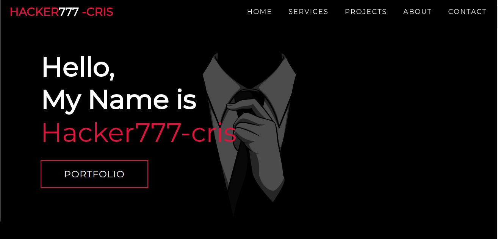

# Hacker777-cris - Portfolio Website

## Table of Contents

- [About](#about)
- [Features](#features)
- [Technologies Used](#technologies-used)
- [Getting Started](#getting-started)
- [Installation](#installation)
- [Usage](#usage)
- [Contributing](#contributing)
- [License](#license)

## About

Welcome to my portfolio website! I'm a passionate Python backend developer, and this platform is designed to showcase my skills, projects, and experiences in the world of software development. Explore my journey, delve into my projects, and get to know the developer behind the code.

## Features

- **Project Showcase:** Discover a collection of my recent projects, ranging from web applications to backend systems.
- **Skills Spotlight:** Explore my skill set, which includes Python, Django, backend development, and more.
- **About Me:** Learn about my background, experience, and what drives me in the field of software development.

## Technologies Used

This portfolio website is built using the following technologies:

- HTML5, CSS3 for structure and styling
- JavaScript for interactive elements
- Bootstrap for responsive design
- Git and GitHub for version control and collaboration

## Getting Started

To explore and run this project locally, follow these steps:

1. Clone the repository: `git clone https://github.com/hacker777-cris/hacker777-cris.git`
2. Navigate to the project directory: `cd hacker777-cris`
3. Open `index.html` in your web browser to view the portfolio.

## Live Website

Visit my live portfolio website at [https://hacker777-cris.github.io/hacker777-cris/](https://hacker777-cris.github.io/hacker777-cris/).

## Usage

Navigate through the website's sections to learn more about me, explore my projects, and gain insights into my skills as a Python backend developer.

## Contributing

If you'd like to contribute to this portfolio or suggest improvements, feel free to follow these steps:

1. Fork the repository.
2. Create a new branch: `git checkout -b feature/my-feature`
3. Make your changes and commit them: `git commit -m 'Add some feature'`
4. Push to the branch: `git push origin feature/my-feature`
5. Create a pull request.

## License

This project is licensed under the [MIT License](LICENSE).
